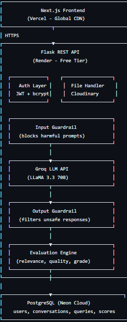

# 🛡️ AI Reliability & Guardrail Platform

A production-ready full-stack platform designed to improve the safety, quality, and reliability of Large Language Model (LLM) outputs in real time.

## Live Demo

- Frontend: https://ai-reliability-platform.vercel.app  
- Backend API: https://ai-reliability-backend.onrender.com  

## Problem Statement

Most AI applications directly return LLM outputs without validation, which can lead to:
- Unsafe or harmful responses  
- Irrelevant or low-quality outputs  
- Poor user experience  

This platform solves the problem by introducing a guardrail and evaluation layer between users and AI models.

## Solution Architecture
User → Input Guardrail → LLM → Output Guardrail → Evaluation Engine → User

- Input Guardrail: Blocks unsafe prompts  
- Output Guardrail: Filters harmful responses  
- Evaluation Engine: Scores response quality  

## Features

### User Features
- JWT-based Login / Signup  
- ChatGPT-style interface  
- Edit and resend messages  
- File uploads (PDF, image, text)  
- Chat history management  
- Light/Dark theme toggle  
- Daily usage limit (30 queries)

### Guardrail System
- Input validation (unsafe prompt blocking)  
- Output filtering (response safety)  
- Logging of blocked queries  

### Evaluation Engine
- Relevance Score  
- Quality Score  
- Length Score  
- Overall Grade (A–F)  

### Admin Dashboard
- View all users and activity  
- Block/unblock users  
- Monitor queries  
- Platform analytics  


## Tech Stack

| Layer       | Technology                     |
|------------|------------------------------|
| Frontend    | Next.js, Tailwind CSS        |
| Backend     | Flask (Python)               |
| Database    | PostgreSQL (Neon)            |
| LLM         | Groq API (LLaMA 3.3 70B)     |
| Auth        | JWT, bcrypt                  |
| Storage     | Cloudinary                   |
| Async       | Redis + Celery               |
| Monitoring  | Langfuse                     |
| Deployment  | Vercel + Render              |
| Container   | Docker                       |


##  System Architecture


## Getting Started

### Prerequisites
- Python 3.11+
- Node.js 20+
- PostgreSQL database (Neon free tier)
- Groq API key (free at console.groq.com)

### Option 1: Docker (Recommended)

```bash
# Clone the repository
git clone https://github.com/JasmineSavathallapalli/AI-Reliability-Platform
cd AI-Reliability-Platform

# Create backend/.env file with your keys (see Environment Variables section)

# Start everything with one command
docker-compose up --build
```

Open http://localhost:3000

### Option 2: Manual Setup

**Backend:**
```bash
cd backend
python -m venv venv

# Windows
venv\Scripts\activate

# Mac/Linux
source venv/bin/activate

pip install -r requirements.txt
python app.py
```

**Frontend:**
```bash
cd frontend
npm install
npm run dev
```

Open http://localhost:3000

## Environment Variables

Create `backend/.env`:

```env
# LLM
GROQ_API_KEY=your_groq_api_key

# Database
DATABASE_URL=your_neon_postgresql_connection_string

# Auth
SECRET_KEY=your_random_secret_key_min_32_chars

# Email (Gmail)
MAIL_EMAIL=your_gmail@gmail.com
MAIL_PASSWORD=your_gmail_app_password

# File Storage
CLOUDINARY_CLOUD_NAME=your_cloud_name
CLOUDINARY_API_KEY=your_api_key
CLOUDINARY_API_SECRET=your_api_secret

# Observability
LANGFUSE_SECRET_KEY=your_langfuse_secret
LANGFUSE_PUBLIC_KEY=your_langfuse_public
LANGFUSE_HOST=https://cloud.langfuse.com

# Async (optional)
REDIS_URL=redis://localhost:6379/0
```

## API Reference

| Method | Endpoint | Description | Auth |
|---|---|---|---|
| POST | `/auth/register` | Create new account | No |
| POST | `/auth/login` | Login to account | No |
| POST | `/auth/forgot-password` | Send reset email | No |
| POST | `/auth/reset-password` | Reset password | No |
| POST | `/query` | Send AI query | Yes |
| GET | `/conversations` | Get user conversations | Yes |
| POST | `/conversations/new` | Start new conversation | Yes |
| GET | `/conversations/:id/messages` | Get conversation messages | Yes |
| DELETE | `/conversations/:id` | Delete conversation | Yes |
| DELETE | `/history/clear` | Clear all history | Yes |
| POST | `/upload` | Upload file | Yes |
| GET | `/admin/stats` | Platform statistics | Admin |
| GET | `/admin/users` | All users | Admin |
| GET | `/admin/queries` | All queries | Admin |
| POST | `/admin/users/:id/block` | Block/unblock user | Admin |

## Author

**Jasmine Savathallapalli**
- GitHub: [@JasmineSavathallapalli](https://github.com/JasmineSavathallapalli)

## License

MIT License — feel free to use this project as a reference or template.
